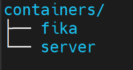

# Setting up Fika SPT server with docker for Ubuntu/Debian/Raspberry Pi
Last updated: 13/08/24

**Make sure your computer is 64-bit! Arm64 works too!**

[For support you should join the Fika Discord server](https://discord.gg/project-fika)

## Table Of Contents

[Installation](https://github.com/OnniSaarni/SPT-Fika-Docker-Guide#installing-docker)

[Updating The Server](https://github.com/OnniSaarni/SPT-Fika-Docker-Guide#updating-to-newer-versions)

[Other Possibly Helpful Info](https://github.com/OnniSaarni/SPT-Fika-Docker-Guide#modding-and-other-possibly-helpful-info)

[Automatic Setup Script](https://github.com/OnniSaarni/SPT-Fika-Docker-Guide/tree/main/files/setupScript)
(Only use if you've already done the setup once before.)

## Free VPS

[A good free VPS from Oracle. It offers 24gb ram, 4 cores and 200gb of storage. It's ARM but works with this setup.](https://www.oracle.com/cloud/free/)

## Installing Docker

First of all you need Docker. [You can download it by following this guide here.](https://docs.docker.com/engine/install/ubuntu/)
This guide is for ubuntu but you can find guides for other operating systems/distributions on their website.

You can verify your Docker installation by running `docker --version`

## Creating a user for docker (Recommended)

For better security, it's recommended to set up a separate user for Docker containers.

```
sudo adduser dockercontainers
```

To be able to use docker with this user add them to the docker group

```
sudo groupadd docker
sudo usermod -aG docker dockercontainers
```

You can log into the new account by entering this command:

```
su - dockercontainers
```

## Setting up the directories

After you've got docker installed you can start by creating a new directory for your project and navigate to it in your terminal.

I'm going to go ahead and create a new directory called "containers" and navigate to it.
You can do this with:

```
mkdir containers
cd containers
```

Now we're going to create a new directories for our Fika Dockerfile and Fika SPT server and navigate to the Dockerfile directory.
You can do this with:

```
mkdir fika
mkdir server
cd fika
```

The file structure looks like this:




## Creating the files

Now we're going to create a new file called "Dockerfile" in the fika directory. **THIS NAME IS CASE SENSITIVE**

You can do this with:

```
nano Dockerfile
```

Inside this file we're going to write the following: [(These are from the Fika Discord)](https://discord.com/channels/1202292159366037545/1236681505451933758)

```
##
## Dockerfile
## FIKA LINUX Container
##

FROM ubuntu:latest AS builder
ARG FIKA=HEAD^
ARG FIKA_TAG=[Insert Tag Here]
ARG SPT=HEAD^
ARG SPT_TAG=[Insert Tag Here]
ARG NODE=20.11.1

RUN echo 'debconf debconf/frontend select Noninteractive' | debconf-set-selections
WORKDIR /opt

# Install git git-lfs curl
RUN apt update && apt install -yq git git-lfs curl
# Install Node Version Manager and NodeJS
RUN git clone https://github.com/nvm-sh/nvm.git $HOME/.nvm || true
RUN \. $HOME/.nvm/nvm.sh && nvm install $NODE
## Clone the SPT repo or continue if it exist
RUN git clone https://dev.sp-tarkov.com/SPT/Server.git srv || true

## Check out and git-lfs (specific commit --build-arg SPT=xxxx)
WORKDIR /opt/srv/project

RUN git checkout tags/$SPT_TAG
RUN git checkout $SPT
RUN git-lfs pull

## remove the encoding from spt - todo: find a better workaround
RUN sed -i '/setEncoding/d' /opt/srv/project/src/Program.ts || true

## Install npm dependencies and run build
RUN \. $HOME/.nvm/nvm.sh && npm install && npm run build:release -- --arch=$([ "$(uname -m)" = "aarch64" ] && echo arm64 || echo x64) --platform=linux
## Move the built server and clean up the source
RUN mv build/ /opt/server/
WORKDIR /opt
RUN rm -rf srv/
## Grab FIKA Server Mod or continue if it exist
RUN git clone https://github.com/project-fika/Fika-Server.git ./server/user/mods/fika-server
WORKDIR ./server/user/mods/fika-server
RUN git checkout tags/$FIKA_TAG
RUN git checkout $FIKA
RUN \. $HOME/.nvm/nvm.sh && npm install
RUN rm -rf ../FIKA/.git

FROM ubuntu:latest
WORKDIR /opt/
RUN apt update && apt upgrade -yq && apt install -yq dos2unix
COPY --from=builder /opt/server /opt/srv
COPY fcpy.sh /opt/fcpy.sh
# Fix for Windows
RUN dos2unix /opt/fcpy.sh

# Set permissions
RUN chmod o+rwx /opt -R

# Exposing ports
EXPOSE 6969
EXPOSE 6970
EXPOSE 6971

# Specify the default command to run when the container starts
CMD bash ./fcpy.sh
```

Press **Ctrl + S** to save and after that press **Ctrl + X** to exit.

You can change the Fika and SPT versions If SPT or FIKA gets updated. In the `Dockerfile` you can change `FIKA_TAG` and `SPT_TAG` args to the version you want. E.g. `ARG FIKA_TAG=v2.1.1` and `ARG SPT_TAG=3.8.3`.

 **Warning!**  Make sure that selected tag versions are compatible. **Please double check the current versions of SPT and Fika!**


And then we will create a new file called "fcpy.sh" in the fika directory. **THIS NAME IS CASE SENSITIVE**

You can do this with:

```
nano fcpy.sh
```

Inside this file we're going to write the following: [(These are from the Fika Discord)](https://discord.com/channels/1202292159366037545/1236681505451933758)

```
# fcpy.sh

#!/bin/bash
echo "FIKA Docker"

if [ -d "/opt/srv" ]; then
    start=$(date +%s)
    echo "Started copying files to your volume/directory.. Please wait."
    cp -r /opt/srv/* /opt/server/
    rm -r /opt/srv
    end=$(date +%s)
    
    echo "Files copied to your machine in $(($end-$start)) seconds."
    echo "Starting the server to generate all the required files"
    cd /opt/server
    chown $(id -u):$(id -g) ./* -Rf
    if [ -f /opt/server/SPT_Data/Server/configs/http.json ]; then
    	sed -i 's/127.0.0.1/0.0.0.0/g' /opt/server/SPT_Data/Server/configs/http.json
	NODE_CHANNEL_FD= timeout --preserve-status 40s ./SPT.Server.exe </dev/null >/dev/null 2>&1
    else
	sed -i 's/127.0.0.1/0.0.0.0/g' /opt/server/Aki_Data/Server/configs/http.json
	NODE_CHANNEL_FD= timeout --preserve-status 40s ./Aki.Server.exe </dev/null >/dev/null 2>&1
    fi
    echo "Follow the instructions to proceed!"
fi

if [ -e "/opt/server/delete_me" ]; then
    echo "Error: Safety file found. Exiting."
    echo "Please follow the instructions."
     sleep 30
    exit 1
fi

cd /opt/server

if [ -f ./SPT.Server.exe ]; then
   ./SPT.Server.exe
else
   ./Aki.Server.exe
fi
echo "Exiting."
exit 0
```

## Setting up the Docker container

After the files have been created we can start the setup.

First off we're going to run this in the "fika" directory:

```
docker build --no-cache --label FIKA -t fika .
```

It will take a while but once it is finished we are going to move on to the next command. 

**In the next command need to change your "PATHTOYOURSERVERFILE" to your server directory path.**
To do this you can navigate to the server directory we created earlier. If you are still in the "fika" directory (you can confirm this by running `pwd` in your current directory), you can navigate to the "server" directory by running:

```
cd ..
cd server
```

Then by running `pwd` you can get the path to your server file. Copy this value and replace it with "**PATHTOYOURSERVERFILE**".

```
docker run --pull=never -v PATHTOYOURSERVERFILE:/opt/server -p 6969:6969 -p 6970:6970 -p 6971:6971 -p 6972:6972 -it --name fika --log-opt max-size=10m --log-opt max-file=3 fika
```


## Starting the container

```
docker start fika
docker update --restart unless-stopped fika
```

After starting the container you can see the logs of it with `docker logs fika -f`

## Helpful Docker commands

To see the logs of the container:

```
docker logs fika -f
```

You can use **Ctrl + C** to exit the logs.


To stop the container:

```
docker stop fika
```

To restart the container:

```
docker restart fika
```


## Updating to newer versions

First off you will have to stop the server with:

```
docker stop fika
```

[How to find out your server directory path](https://gist.github.com/OnniSaarni/a3f840cef63335212ae085a3c6c10d5c#setting-up-the-docker-container)

It is recommended to backup your profiles in your server/user/profiles directory. You can copy them to your home directory with this command (assuming you made an account earlier):

```
cp -r PATHTOYOURSERVERFILE/server/user/profiles /home/dockercontainers/profilesBackup
```

The profile files will be copied over to your home directory. If you haven't made a separate account you should change the command.

Next we need to delete the container and the image. We can do that by running these commands:

```
docker rm fika
docker rmi fika
```

After that we need to rebuild the container:

```
docker build --no-cache --label FIKA -t fika .
```

And then we can start it back up with: [REMEMBER TO CHANGE PATHTOYOURSERVERFILE](https://gist.github.com/OnniSaarni/a3f840cef63335212ae085a3c6c10d5c#setting-up-the-docker-container)

```
docker run --pull=never -v PATHTOYOURSERVERFILE:/opt/server -p 6969:6969 -p 6970:6970 -p 6971:6971 -p 6972:6972 -it --name fika --log-opt max-size=10m --log-opt max-file=3 fika

docker start fika
docker update --restart unless-stopped fika
```

Now your server is updated.

[To update your client you can follow the instructions here.](https://dev.sp-tarkov.com/SPT/Stable-releases/releases) [You will also need to download the newest Fika plugin from here.](https://github.com/project-fika/Fika-Plugin/releases)

## Modding and other possibly helpful info

To play with your friends you first have to port forward or disable the firewall for port 6969 on the server.

To host Co-Op raids with your friends you either have to have UPnP enabled or have port 25565 forwarded to your PC. 
You should also disable the firewall for the EscapeFromTarkov.exe and allow ports in the firewall. [More info over here](https://github.com/project-fika/Fika-Documentation?tab=readme-ov-file#installation)

To add more mods to the game you have to add them to the "users" directory in the server directory.

http.json should be pre configured for portforwarding in this setup.

[You might also want to look into making automatic backups with cron.](https://unix.stackexchange.com/a/16954)
It's not neccessary but it's a plus. I'm not going to go into it in depth but if someone wants they are free to make a simple guide for it.

## Credits

Thanks to @MonstraG and @lommy7 for helping others in the comments and providing fixes.

[Special thanks to k2rlxyz for making the original Dockerfile.](https://hub.docker.com/r/k2rlxyz/fika) It can also be found in the [Discord](https://discord.gg/project-fika).
